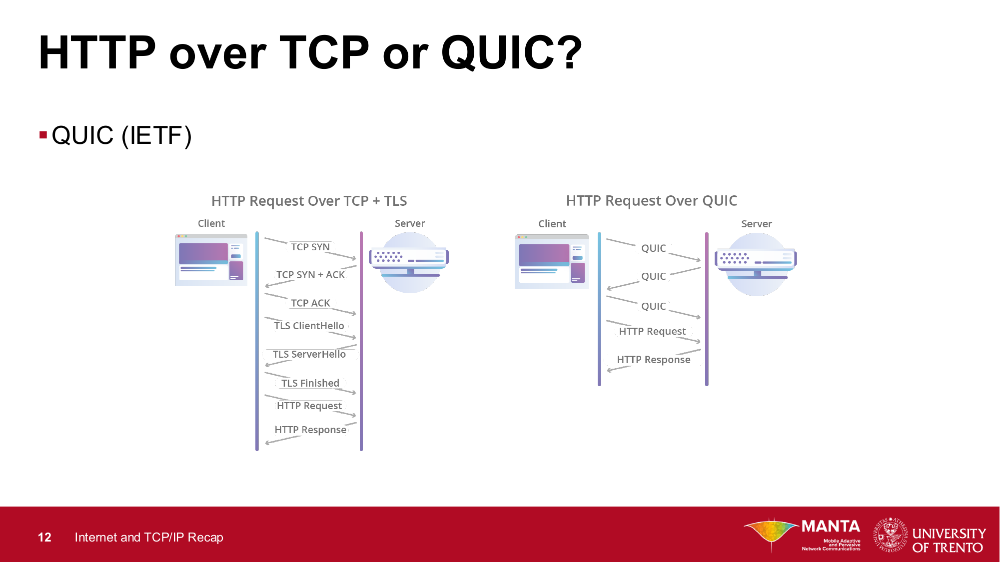

# PDF 2 — TCP/IP Recap

> Segata calls this "extremely important." Everything else in the course assumes
> these concepts are solid.

This PDF has 5 themes:

1. The 5-layer TCP/IP model
2. How a host joins a network (DHCP, ARP, cross-LAN routing)
3. Wireless & mobile network basics
4. How we test/measure networks
5. Key performance indicators

---

## Theme 1: The 5-layer TCP/IP Model

```
+-----------------+
|   Application   |  HTTP, SMTP, FTP, DNS  -- user's program
+-----------------+
|   Transport     |  TCP (reliable), UDP (fast), QUIC
+-----------------+
|    Network      |  IP -- best-effort packet delivery
+-----------------+
|      Link       |  Ethernet, WiFi -- local hop
+-----------------+
|    Physical     |  the actual electrical/radio waveform
+-----------------+
```

**Core principle:** each layer has one job. The layer above doesn't care how
that job is done. That's why your Python TCP socket doesn't care if it's
flowing over fiber, copper, or 5G.

### Application layer
**Job:** be the user-facing program. HTTP, SMTP, FTP, DNS.

### Transport layer
**Job:** get data from one *process* to another, end-to-end. Uses **port numbers**.

| | TCP | UDP |
|---|---|---|
| Reliable? | Yes (retransmits) | No |
| Ordered? | Yes | No |
| Congestion control? | Yes | No |
| Speed | Slower | Faster |
| Use cases | Web, email, file transfer | DNS, video calls, gaming |
| Share of internet | ~90% | the rest |

**TCP flavors to know by name:**
- **TCP New Reno** — the classic; what textbooks describe.
- **TCP CUBIC** — Linux default; more aggressive on fast networks.
- **TCP BBR** — Google; doesn't use packet loss as the congestion signal.

**QUIC** — newer; runs on UDP, adds reliability + encryption + faster handshake.
HTTP/3 uses QUIC. Saves a lot of round-trips vs. TCP+TLS.



### Quick aside: what is TLS?

**TLS = Transport Layer Security.** It's the encryption layer that turns plain
HTTP into HTTPS (the padlock in your browser). Two jobs:

- **Encrypt** the traffic so nobody on the path can read it.
- **Authenticate** the server (via a certificate) so you know you're really
  talking to `bank.com` and not an impostor.

TLS doesn't replace TCP — it sits **on top of TCP**, between TCP and HTTP:

```
+--------+
|  HTTP  |   <- application data
+--------+
|  TLS   |   <- encryption / authentication
+--------+
|  TCP   |   <- reliable transport
+--------+
|  IP    |
+--------+
```

That's why the classic stack is "HTTPS = HTTP over TLS over TCP."

### Why QUIC is faster (reading the diagram)

Look at the left side: with **TCP + TLS** you pay for **two separate handshakes**
before any HTTP data flows:

1. TCP handshake — SYN, SYN+ACK, ACK (1 round-trip)
2. TLS handshake — ClientHello, ServerHello, Finished (another round-trip)

Only *then* can the HTTP Request go out. That's roughly **3 round-trips** of
overhead before the first useful byte.

On the right, **QUIC** combines transport + encryption into one protocol. Its
handshake bundles what TCP and TLS were doing separately, so the HTTP Request
goes out after about **1 round-trip**. On repeat visits to the same server,
QUIC can even do **0-RTT** — sending HTTP data with the very first packet.

For a single web request the savings are milliseconds; for a page that pulls
dozens of resources, it adds up to noticeable speedup. That's why HTTP/3 was
built on QUIC and why Google, Cloudflare, and Facebook were so eager to ship it.

### Network layer
**Job:** move packets hop by hop across networks, anywhere on Earth.

Protocol: **IP** (v4 or v6). Traits:
- **Datagram** model — every packet independent, no "connection."
- **Best-effort** — no guarantees. Packets can be lost, reordered, or corrupted.
- **Works over anything** — fiber, WiFi, satellite. The "narrow waist" of the internet.

If you want guarantees, that's TCP's job above.

### Link layer
**Job:** move a frame across **one hop** — between two directly connected devices.

Two sub-jobs:
- **LLC** — flow & error checking (mostly invisible)
- **MAC** — who can talk on the shared medium, plus addressing via **MAC addresses**

> Crucial fact: MAC addresses only matter on a local segment.
> They don't survive crossing a router.

### Physical layer
**Job:** turn bits into actual signals (voltage, light, radio) and back.

Dominant technique today: **OFDM**. Used by WiFi, 4G/5G, DVB-T.

> **Course-relevant:** the physical and MAC layers can be modified without
> changing anything above them. This is exactly what **SDR** exploits — replace
> the physical layer with software, the rest of the stack doesn't notice.

---

## Theme 2 (part A): IP addressing, switches/routers, DHCP, ARP

### IPv4 addressing recap

```
IP Address:   192 . 168 . 1 . 50
Subnet Mask:  255 . 255 . 255 . 0
              |----network----| |host|
```

- The mask splits the address into **network bits** and **host bits**.
- `255.255.255.0` = `/24` = first 24 bits are the network.
- Two reserved hosts in every subnet:
  - `.0` = network address (refers to the whole subnet)
  - `.255` = broadcast address (sends to everyone in the subnet)

**Why it matters:** every device applies its mask to a destination IP and asks
"is this local or remote?" That decision drives whether to deliver directly or
hand off to a router.

### Switch vs Router

| | Switch | Router |
|---|---|---|
| Layer | 2 (Link / MAC) | 3 (Network / IP) |
| What does it look at? | **MAC** addresses | **IP** addresses |
| Scope | Inside one local network | Connects different networks |
| Speed | Very fast (hardware) | Slower (more thinking) |
| Cost per port | Cheap | Expensive |

- A **switch** is like a smart power strip: it learns which MAC is on which port.
  Unknown destination MAC -> flood; known -> filter (send only to right port).
- A **router** has a **routing table**: "network X is reachable via next-hop Y."

Modern enterprise gear often blurs the line, but keep them conceptually separate.

### DHCP — how a host joins a network

A freshly plugged-in host needs 4 things:

1. An **IP address**
2. A **default gateway** (the router to reach the rest of the world)
3. A **subnet mask**
4. A **DNS server**

The exchange is the **DORA** dance:

```
Host                                   DHCP server
  |-- Discover --"Anyone got an IP?" ----->|   (broadcast)
  |<- Offer    --"Here's 192.168.1.50"-----|
  |-- Request  --"OK, I'll take it" ------>|
  |<- Ack      --"Granted"-----------------|
```

> First message is a **broadcast** — the host has no IP yet, so it shouts to
> everyone. This is one of the legitimate uses of `255.255.255.255`.

### ARP — finding the next-hop MAC

You have an IP. You want to talk to `192.168.1.99` on your LAN. But the link
layer speaks **MAC**, not IP. You need to map the IP to a MAC.

```
Your laptop                       Everyone on the LAN
  |-- ARP Request --"Who has .99?" ----->|   (broadcast)
  |                                       |  most ignore
  |<- ARP Reply --"That's me, MAC=88:..."| (only .99 replies)
```

The result is cached in your **ARP table** so you don't broadcast every time.

### Putting it together — the sequence

1. **DHCP** gets you IP, mask, gateway, DNS.
2. For every packet, ask: "Is the destination on my local subnet?"
   - **Yes** -> ARP for destination's MAC, send directly.
   - **No**  -> ARP for **gateway's** MAC, send to the gateway and let it handle it.

This last bullet is the bridge to the cross-LAN walkthrough (Part 3, coming next session).

---

## Theme 2 (part B): Cross-LAN packet walkthrough (A -> R -> B)

> The single most important example in the whole TCP/IP recap. Segata spends
> 5 slides on it. Almost every later topic (VLAN, VPN, VXLAN, SDN) is a tweak
> on this exact mechanism.

### Topology

Two LANs joined by a router R.

```
   LAN 1: 111.111.111.0/24                LAN 2: 222.222.222.0/24

      A                                                 B
      |  111.111.111.111                                |  222.222.222.222
      |  MAC-A                                          |  MAC-B
      |                                                 |
      |              R                                  |
      +----------+   +----+----------------------+      |
                 |   |    |                      |      |
                 +---+    +----------------------+------+
                  eth0                      eth1
              111.111.111.110         222.222.222.220
                  MAC-R1                  MAC-R2
```

Assumptions:
- A and B are on **different** networks -> they cannot talk directly.
- R is the gateway for both LANs (one IP/MAC per interface).
- A already knows B's IP (somehow), R's IP (from DHCP), and R's MAC (from ARP).

### Step 1 — A builds the packet

A applies its subnet mask, sees that B is **not** local, so it sends to the gateway.

```
+---- Ethernet frame ----+
|  MAC src: MAC-A        |  <- me
|  MAC dst: MAC-R1       |  <- gateway's MAC on my side
|  +---- IP datagram ----+
|  |  IP src: 111.111.111.111 (A)
|  |  IP dst: 222.222.222.222 (B)   <- final destination
|  |  ...payload...
|  +-------------------+
+------------------------+
```

**Subtlety:** IP destination is B (final dest), MAC destination is R (next hop).

### Step 2 — Frame reaches R

- R sees its own MAC as destination -> accepts the frame.
- R strips the Ethernet header. Only the IP datagram remains.
- R consults its routing table for `222.222.222.x` -> "send out eth1".

### Step 3 — R rewraps and forwards to B

R does ARP on LAN 2 to find B's MAC (or uses its cache), then builds a fresh frame.

```
+---- Ethernet frame ----+
|  MAC src: MAC-R2       |  <- R's MAC on LAN 2
|  MAC dst: MAC-B        |  <- B is local from R's view
|  +---- IP datagram ----+
|  |  IP src: 111.111.111.111 (A)   <- UNCHANGED
|  |  IP dst: 222.222.222.222 (B)   <- UNCHANGED
|  |  ...payload...
|  +-------------------+
+------------------------+
```

### What changed, what didn't

| Field | A -> R | R -> B | Changed? |
|---|---|---|---|
| IP source | A | A | no |
| IP destination | B | B | no |
| MAC source | MAC-A | MAC-R2 | yes |
| MAC destination | MAC-R1 | MAC-B | yes |

### Step 4 — B receives

B sees its MAC as destination -> accepts. Sees its IP as destination -> processes payload. Done.

### The single sentence to remember

> **End-to-end addresses (IP) stay the same the entire journey.**
> **Hop-by-hop addresses (MAC) get rewritten at every router.**

### Why this matters for the rest of the course

Most "next-gen" technologies are tweaks on this template:

| Technology | What it changes |
|---|---|
| **VLAN** | Adds a 4-byte tag inside the Ethernet frame so multiple virtual LANs share one switch. |
| **VPN** | Encrypts the entire IP datagram and stuffs it inside a new IP datagram (tunneling). |
| **VXLAN** | Stuffs the entire Ethernet frame inside a UDP/IP packet to ship across a routed datacenter. |
| **SDN** | A central controller dictates what routers do instead of distributed routing protocols. |

---

## Theme 3: Wireless & Mobile Network Basics

### Wired vs Wireless tradeoff

| | Wired | Wireless |
|---|---|---|
| Capacity per user | Dedicated per cable | **Shared** with everyone in range |
| Interference | Controllable | Constant battle |
| Cost to deploy | Expensive | Cheaper |
| Reach | Stops at the cable | Anywhere in range |
| Mobility | None | Yes |

> One-liner: wired is fast and predictable but immobile; wireless is mobile
> but you fight physics every day. Every wireless headache traces back to
> "shared resource + harsh environment."

### Three pieces of any wireless network

```
   [phone] )) (( [AP / base station] ----- wired backhaul ----- [Core / Internet]
   [laptop] ))((
```

1. **Wireless hosts** — phones, laptops, IoT. May or may not be mobile.
2. **Base station / access point** — relay between radio side and wired backbone.
   Handles medium-access coordination (CSMA/CA for WiFi, scheduled slots for cellular).
3. **Network infrastructure** — the wired backbone, eventually the internet.

### Mobile network architecture: RAN vs Core

```
   Phone --- [eNB / gNB] --- [Core] --- Internet
             <--- RAN --->   <- CN ->
```

- **RAN (Radio Access Network)** — towers/antennas, protocols that turn radio
  into packets. Tower called **eNodeB** in LTE, **gNodeB** in 5G.
- **CN (Core Network)** — operator backbone: billing, mobility tracking,
  authentication, gateway to internet.
- Splitting them lets each side be upgraded independently.

> 5G heavily virtualizes both the Core and (increasingly) the RAN —
> running them as software on commodity servers. Direct application of
> NFV and SDN.

### Wireless standards landscape

| Category | Range | Examples | Use case |
|---|---|---|---|
| **WPAN** | ~10 m | Bluetooth, ZigBee | Headphones, IoT |
| **WLAN** | ~100 m | WiFi (802.11) | Home/office internet |
| **WMAN** | ~km | WiMAX | City broadband (legacy) |
| **WAN** | regional | GSM, UMTS, LTE, 5G | Phones, anywhere |

Trends to remember:
- Each step up trades data rate for coverage.
- WiFi keeps pushing right on the chart (802.11ax / Wi-Fi 6 -> gigabit).
- 5G blurs the line between WAN and WLAN.
- **802.11p** is a special flavor of WiFi tuned for cars -> the SDR labs use it.

---

## Theme 4: How we test/measure networks

Four methodologies, each with different tradeoffs.

| Method | What it is | Speed | Accuracy | Cost |
|---|---|---|---|---|
| **Analytical** | Pure math (queueing theory, probability) | Very fast | Often inaccurate | Free |
| **Simulation** | Software model, no real hw (ns-3, ns-2) | Slow per run | Better | Software |
| **Emulation** | Real OS / real stack, virtual topology (Kathará, Mininet) | Slower | Very close to reality | Workstation |
| **Measurement** | Build the actual thing (testbed) | Slowest | Gold standard | Real hardware |

**Going down the list:** closer to reality, more time/money/complexity.

**This course uses two heavily:**
- **Emulation** with **Kathará** — for SDN, VPN, VXLAN labs.
- **Measurement** with **USRP / CUBE EVK** — for SDR labs.

> For your project: SDN projects = emulation (Kathará). SDR projects = measurement (real radios).

---

## Theme 5: KPIs (what your project will be graded on)

### Throughput
Rate of successful message delivery. Measured in bps. The `iperf` tool measures this.

### Goodput
**Useful** throughput delivered to the app — excludes retransmissions and overhead headers.
- Always **<=** throughput.
- Example: 100 Mbps throughput with 30% retransmits/headers -> ~70 Mbps goodput.

### Link utilization
Fraction of a link's capacity in use. High = efficient. Too high = congestion.
Directly relevant to the **network slicing** project.

### Latency
Time for a packet to travel source -> destination.
- **One-way** latency: hard to measure (clock sync needed).
- **RTT (Round-Trip Time)**: easy with `ping`, most commonly quoted.

For some apps, latency > throughput in importance (gaming, voice, autonomous cars).

### Jitter
**Variation** in latency between consecutive packets.
- Same average latency can have wildly different jitter.
- Jitter kills real-time media (voice, video). Smoothed with **playout buffers** at the
  cost of extra latency.

### Quality of Experience (QoE) and Mean Opinion Score (MOS)
Subjective, human-centric metrics.
- **QoE** — overall user delight/annoyance.
- **MOS** — 1 (bad) to 5 (excellent) score for media quality.

These exist because throughput isn't the whole story: 100 Mbps that drops every 5s
gives terrible QoE.

### Modern apps demand different things

| App | Cares most about |
|---|---|
| Web browsing | Latency + throughput |
| Video streaming | Throughput, low jitter |
| VoIP / video call | Low latency + low jitter |
| Online gaming | Low latency above all |
| Autonomous driving | Low latency + reliability |
| IoT sensor swarm | Massive scale, latency-tolerant |
| Cloud storage | Throughput, latency-tolerant |

This diversity is **why next-gen networks need flexibility** — one-size-fits-all
won't satisfy a self-driving car *and* a backup job at the same time.
This is the seed of the **network slicing** idea later in the course.

---

## PDF 2 Final Recap

1. The **5-layer stack** and each layer's job.
2. The **two-address model** (IP end-to-end, MAC hop-by-hop) + A -> R -> B walkthrough.
3. **DHCP** and **ARP** — how a host connects and finds neighbors.
4. **Wireless basics** — RAN, Core, WPAN/WLAN/WMAN/WAN.
5. **Test methodologies** + the **6 KPIs** (throughput, goodput, utilization, latency,
   jitter, QoE/MOS).
